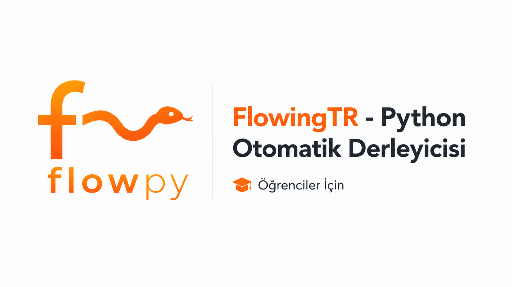

<p align="center">
  
</p>

# FlowPy

FlowPy, Python projelerini otomatik olarak derlemek için geliştirilmiş açık kaynaklı bir araçtır.

Amacı, Python ile çalışan kullanıcıların derleme işlemlerini daha kolay ve hızlı bir şekilde yapabilmesini sağlamaktır. Özellikle öğrenciler, öğretmenler ve yeni başlayan geliştiriciler için daha basit bir kullanım deneyimi sunmayı hedefler.

## Kurulum


Öncelikle projeyi bilgisayarınıza indirin.


```bash
git clone https://github.com/bercaius/FlowPy.git
```
Proje klasörüne girin.

```bash
cd FlowPy
```
Gerekli bağımlılıkları yükleyin.
```bash
pip install -r requirements.txt
```
Kurulum tamamlandıktan sonra FlowPy'yi çalıştırabilirsiniz.
```bash
python main.py
```

# Kullanım

FlowPy çalıştırıldıktan sonra derlemek istediğiniz Python projesini seçin.

Proje seçimi ve gerekli ayarlar yapıldıktan sonra derleme işlemini başlatabilirsiniz. FlowPy işlemleri otomatik olarak gerçekleştirir ve oluşturulan çıktıları belirlenen konuma kaydeder.

# Özellikler

Python projelerini otomatik olarak derleme.

Basit ve anlaşılır kullanım yapısı.

Geliştirilebilir açık kaynak mimarisi.

Öğrenciler ve geliştiriciler için kolay kullanım.

# Geliştirme

FlowPy aktif olarak geliştirilmektedir.

Projeye katkıda bulunmak, hata bildirmek veya yeni özellik önermek için GitHub üzerinden issue açabilir veya pull request gönderebilirsiniz.

# Lisans

Bu proje MIT License ile lisanslanmıştır.

Copyright (c) 2026 Berkay Özdemir (bercaius) - TurcoDevelopStudio